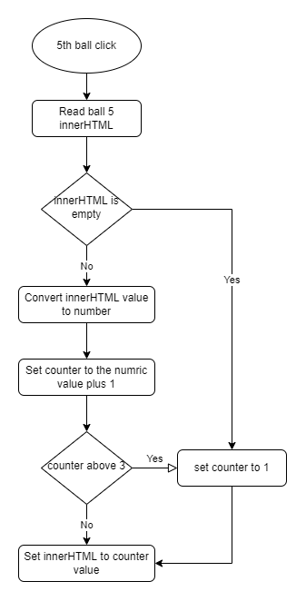

# HW_Ball5

## The Task
- Assumptions:
    - We have an html element with class <b>`ball5`</b>
    - The `ball5` element is clickable and runs a function called <b>`onBall5Click`</b>
    - `ball5` may not have any inner text at first
- Functionality:
    - `ball5` innerText should be a <u>counter</u> starting with 1
    - For each click `ball5` increase <u>counter</u> by 1, until reaches 3.<br/>
      Once hits 3, it should go back to 1. e.g.: 1.. 2.. 3.. 1.. 2.. 3..

## Solution approach
We may start coding any try things out, or write some algorithm first.<br/>
I preffer starting with algorithm for newbies or when the flow is not very clear.

## Algorithm
- Start from `ball5` click - `onBall5Click`
- Read `ball5` `innerHTML`
- Check if `innerHTML` is empty
    - Yes:
        - Set <u>`counter`</u> to 1
    - No: 
        - Convert `innerHTML` value to number
        - Set <u>`counter`</u> to the numric value plus 1
        - Check if <u>`counter`</u> above 3
            - Yes
                - Set <u>`counter`</u> to 1
- Set `innerHTML` to <u>`counter`</u> value

### Here is a diagram of the algorithm written above
Consider always working with diagrams, it makes algorithm simpler and coding faster. <br/>


## Code
Lets convert the algorithm into code, only comments at first.
```javascript
function onBall5Click() {
    // declaring variables

    // Read ball5 innerHTML

    // Check if innerHTML is empty
        // Yes
            // Set counter to 1

        // No

        // Convert innerHTML value to number

        // Set counter to the numric value plus 1

        // Check if counter above 3
            // Yes
                //Set counter to 1 

    // Set innerHTML to counter value
}
```

Now we can fill the relevant code
```javascript
function onBall5Click() {
    // declaring variables
    var counter = 1

    // Read ball5 innerHTML
    var ball5textValue = document.querySelector('.ball5').innerHTML;
    // Note that ball5textValue has the textual value, this means that when the current counter is -1- ball5textValue has "1" not 1.
    // Javascript handles "1" different than 1, espially on math operations

    // Check if innerHTML is empty
    if (ball5textValue == "") {
    // Yes
        // Set counter to 1
         counter = 1
    }
    else {         
    // No

        // Convert innerHTML value to number
        ball5numberValue = parseInt(ball5textValue)
        // Now ball5numberValue has the numeric value - such as 1 not "1"

        // Set counter to the numric value plus 1
        counter = ball5numberValue + 1

        // Check if counter above 3
        if (counter > 3) {
        // Yes
            //Set counter to 1
            counter = 1
        }
    }
    // Set innerHTML to counter value
    document.querySelector('.ball5').innerHTML = counter
}
```
We, developers, don't like writing the same piece of code twice and always seek to make our code better.<br/>
As we can see, `counter = 1` is written 3 times. `counter` value sometimes never change from the declaration. <br/>
Here we can do some improvments:
1. We can check if `ball5textValue` is not empty, as if empty - do nothing (`counter` remains 1)
2. We can check if `ball5numberValue` is not 3, as if equal to 3 - do nothing (`counter` remains 1)

Let's refactor our code.
```javascript
function onBall5Click() {
    // declaring variables
    var counter = 1

    // Read ball 5 innerHTML
    var ball5textValue = document.querySelector('.ball5').innerHTML;

    // innerHTML is not empty
    if (ball5textValue !== "") {
        // Convert innerHTML value to number
        ball5numberValue = parseInt(ball5textValue)

        // prevent counter above 3
        if (ball5numberValue != 3) {
            // Set counter to the numric value plus 1
            counter = ball5numberValue + 1
        }
    }

    // Set innerHTML to counter value
    document.querySelector(',ball5').innerHTML = counter
}
```